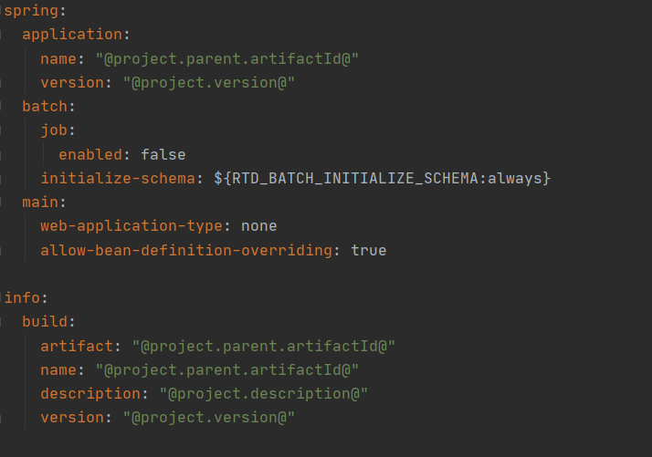
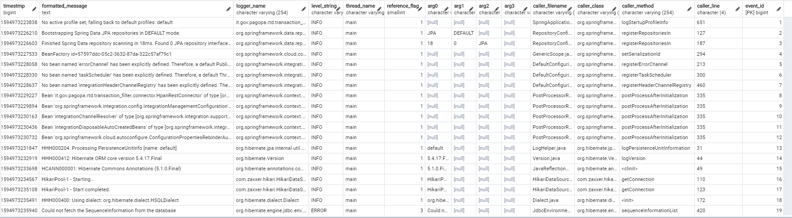

# Acquirer Transaction Filter Batch

Component defining the batch process for filtering the input transaction records, based on a list of pan,
recovered from a local directory or through a remote service. 

### Execution requirements

The artifact consists of an executable jar produced with _spring-boot_, therefore all the project dependencies are contained within the jar, together with the classes that contains the business logic.
The artifact is completely autonomous and usable on any device that has a JVM

To install and run the batch, it's required:
- _Java 1.8+_
- _batch-transaction-filter.jar_ artifact

For the application of PGP encryption to the result file, produced by the batch, there will also need a file containing the public key to be used, reported in __Appendix 1 - PGP public key__.
For the application of decryption of the PGP pan file, it must provided a file containing the secret key to be applied for the operation.
To produce the artifact from the source code it will be necessary to have an installation of Maven and a java compiler (jdk1.8+).

### Generating artifact from source

To obtain a version of the artifact produced directly from the source code, a Maven instance must be appropriately configured on the
machine to use via the command line. Once the source has been downloaded, run the following command from the root directory:

> mvn clean package __<execution_options>__
	
If the command is executed without other options, the artifact will be produced once the unit tests (declared in the module) have been
performed. To perform the operation without waiting for the execution and validation of the tests, run the command in the following
form:

>mvn clean package -DskipTests
	
The artifact will be created into the target folder at root level

### Database connection

Spring Batch uses a repository on which you can track the executions performed by the service. 
If there is no particular configuration: an in- memory instance will be executed to allow the batch to be executed. 
Please refer to the properties in __Appendix 2 - Configuration properties__ to define the usage of a persistent database.

__Note:__ As of today, Oracle RDBMS are subject to potential issues regarding the isolation level, as reported
in the following [Issue Thread](https://github.com/spring-projects/spring-batch/issues/1127), the general approach to
attempt to avoid similar problems, is to reduce the isolation level defined in the Spring Batch jobRepository 
to either _ISOLAION_READ_COMMITTED_, or _ISOLAION_READ_UNCOMMITTED_. this is doable using the configuration property
_batchConfiguration.TransactionFilterBatch.isolationForCreate_.

### Execution methods

Available execution methods are either: single-execution, or scheduled execution. This configuration is defined through
the property _spring.batch.job.scheduled_, a true/false property to define the execution mode, the default value is
configured for a scheduled execution. In case of a scheduled execution, the process will restart when matching
the cron expression defined in the property _batchConfiguration.TransactionFilterBatch.cron_.

__Note__: The property _spring.batch.job.enabled_ must as to be configured to false, when overriding the default
property configurations.

### REST Services Connection

The Batch Acquirer is configurabile for contacting the salt recovery service, to be applied for the PAN hashing,
and the hpan list recovery service, to be used for filtering the transaction records.
To enabled this services, the following configuration properties must be enabled:
_batchConfiguration.TransactionFilterBatch.saltRecovery.enabled_ 
and _batchConfiguration.TransactionFilterBatch.hpanListRecovery.enabled_. 

Endpoint configurations are through the properties _rest-client.hpan.base-url_, for the base configuration
, and the endpoint properties for the two services respectively _rest-client.hpan.list.url_ and _rest-client.hpan.salt.url_.

If the client is to be configured for TLS 1.2 protocol usage, the configuration property 
_rest-client.hpan.mtls.enabled_ is to be used, and the keystore and trust-store files for the client, to be applied
in the certificate exchange, respectively through the _rest-client.hpan.key-store.file_ and
_rest-client.hpan.trust-store.file_ properties. 

Other applicable configurations are those related to passwords to be applied for certificates,
identified by the _rest-client.hpan.key-store.password_ and _rest-client.hpan.trust-store.password_ configurations.
The type used for files containing certificates can also be defined,
and the algorithm used for the encryption. By default the files are in Java's JKS format,
using the standard implementation of the X509 algorithm. For dedicated configurations refer to
properties listed in __Appendix 2 - Configuration properties__.

To use a proxy configuration for the rest client, either use the standard env configurations, or enable
the internal configuration through the property _rest-client.hpan.proxy.enabled_, and the related configurations
for the proxy host, port, username and password.

Services hosted through Azure will require a subscription key, this can be configured using the property 
__rest-client.hpan.api.key__. 

For the list recovery service additional configurations are considered for extracting the resource through a compressed file
(default setting for the exposed Azure enviroment), enabled through the property __rest-client.hpan.list.attemptExtraction__,
the resource matching __rest-client.hpan.list.listFilePattern__ is considered to be a valid
hpan list file.

Checksum validation for the recovered file is enabled through the property __rest-client.hpan.list.checksumValidation__,
the resource checksum is extracted through the header configured with __checksumHeaderName__.

Date validation for the recovered file is enabled through the property __rest-client.hpan.list.dateValidation__,
the resource creation/update timestamp is extracted through the header configured with __dateValidationHeaderName__, and
defined with the timestamp pattern defined in __rest-client.hpan.list.dateValidationPattern__, if enabled the execution date
is compared with the recovered timestamp, if the difference exceeds 24 hours, an exception is thrown.

To generate a keystore from the a .pfx file, use the following commands to produce a JKS file:

> openssl pkcs12 -export -out <PFX_FILE>.pfx -inkey <PRIVATE_KEY_FILE>.key -in <CLIENT_CERTIFICATE_FILE>.pem

> keytool -importkeystore -srckeystore <PFX_FILE>.pfx -srcstoretype pkcs12 -destkeystore <JKS_FILE> -deststoretype JKS

To include the [Microsoft Certificate](https://cacert.omniroot.com/bc2025.crt) (only for SIT env) in the JKS trustore:

> keytool -import -trustcacerts -file bc2025.crt -alias microsoft-server -keystore <TRUSTSTORE_FILE> -storepass <TRUSTSORE_PASSWORD>

To include the Entrust CA Chain ([Entrust Root Certification Authority](https://web.entrust.com/root-certificates/entrust_ev_ca.cer?_ga=2.91873948.700920475.1600672559-1785033261.1600339748), [(Non‐EV SSL) CA - L1K](https://web.entrust.com/root-certificates/entrust_l1k.cer?_ga=2.91873948.700920475.1600672559-1785033261.1600339748), [Cross Cert - L1K](https://web.entrust.com/root-certificates/entrust_l1k_chain_root.cer?_ga=2.87336862.700920475.1600672559-1785033261.1600339748)) in the JKS trustore:

> keytool -import -trustcacerts -file entrust_ev_ca.cer -alias cstar-server -keystore <TRUSTSTORE_FILE> -storepass <TRUSTSORE_PASSWORD>

> keytool -import -trustcacerts -file entrust_l1k_chain_root.cer -alias cstar-server -keystore <TRUSTSTORE_FILE> -storepass <TRUSTSORE_PASSWORD>

> keytool -import -trustcacerts -file entrust_l1k.cer -alias cstar-server -keystore <TRUSTSTORE_FILE> -storepass <TRUSTSORE_PASSWORD>

Explanations on how to use the java keytool commands are in the
[official guidelines](https://docs.oracle.com/javase/8/docs/technotes/tools/unix/keytool.html).

References for introducing the Azure truststore key in your system, is in the official 
[Azure Reference Guidelines](https://docs.microsoft.com/it-it/azure/developer/java/sdk/java-sdk-add-certificate-ca-store)

For references to the services displayed through Azure's API service, you can find the corresponding links in 
__Appendix 4 - RTD Acquirer Interface__.

### Minimal Configuration on Override

When overriding the application.yaml file with an external configuration, the following minimal configuration has to be
maintained, in order to have the correct setup for the batch execution.

### Execution guidelines

- Install and configure the environment so that the Java 1.8+ version is available, as indicated in the prerequisites                

- Produce a version of the artifact via source code, as indicated in the corresponding
  paragraph of the manual. Prepare a configuration application.yml file and, if needed, other files .yml or .properties to be used for
  the configuration properties.

- Place the _batch-transaction-filter.jar_ artifact in a location of your choice

- Place in a location of your choice, the configuration files

- Place on the machine, the files of the public and/or private key for pgp, if one of the file encryption/decryption function is active. 

- Configure the path to the file containing the public key, through the
  batchConfiguration.TransactionFilterBatch.transactionFilter.publicKeyPath property, or through the environment variable
  _ACQ_BATCH_INPUT_PUBLIC_KEYPATH_.         
   
  __Note:__ The configuration is strictly needed only if the encryption function of the produced files is enabled. 
  In the case of configuration on file, the path must be preceded by the prefix _file:/_. for example:
   
  >batchConfiguration.TransactionFilterBatch.transactionFilter.publicKeyPath = file:/C/:Development/keys/public.asc

- Configure the pointing to the file containing the private key, through the property
  _batchConfiguration.TransactionFilterBatch.panList.secretKeyPath_, or through the environment variable
  _ACQ_BATCH_INPUT_SECRET_KEYPATH_. 

  __Note:__ The configuration is strictly necessary only if the decryption function of the files containing the pan list is enabled. 
  In the case of configuration on file, the path must be preceded by prefix _file:/_. for example::

  >batchConfiguration.TransactionFilterBatch.panList.secretKeyPath = file:/C:/Development/keys/secret.asc
	
- Configure the passphrase to be applied if the secret key is enabled, through the
  _batchConfiguration.TransactionFilterBatch.panList.passphrase_ property , or via the _ACQ_BATCH_INPUT_SECRET_PASSPHRASE_ environment
  variable.         

- Define a folder where the path files, to be processed, will be placed

- Define _batchConfiguration.TransactionFilterBatch.hpanListRecovery.dailyRemoval.enabled_ parameter on _TRUE_ in case
  of daily removal for stored PAN files

- Configure the path to the transaction files to be processed, through the
  _batchConfiguration.TransactionFilterBatch.transactionFilter.transactionDirectoryPath_ property, or through the environment variables
  _ACQ_BATCH_TRX_INPUT_PATH_ for the folder, and _ACQ_BATCH_INPUT_FILE_PATTERN_, for the pattern of files to read. 

  __Note:__  In the case of file configuration, the path must be preceded by the prefix _file:/_. for example: 

  >batchConfiguration.TransactionFilterBatch.transactionFilter.transactionDirectoryPath = file:/C:/Development/transactions/*.csv

- Define a folder for the files containing the PAN list 

- Configure the path to the files containing the pan list, through the
  _batchConfiguration.TransactionFilterBatch.panList.hpanDirectoryPath_ property , or through the environment variables
  _ACQ_BATCH_HPAN_INPUT_PATH_ for the folder, and  _ACQ_BATCH_HPAN_INPUT_FILE_PATTERN_, for the pattern of files to read.
 
  __Note:__  In the case of configuration on file, the path must be preceded by the prefix _file:/_. for example: 

  >batchConfiguration.TransactionFilterBatch.panList.hpanDirectoryPath = file:/C:/Development/hpan/*.pgp

- Define a folder for the output files

- Configure the pointing to the trace files to be processed, through the property
  _batchConfiguration.TransactionFilterBatch.transactionFilter.outputDirectoryPath_, or through the environment variable _ACQ_BATCH_OUTPUT_PATH_      

  __Note:__  In the case of configuration on file, the path must be preceded by the prefix _file:/_. for example:

  >batchConfiguration.TransactionFilterBatch.transactionFilter.outputDirectoryPath = file:/C:/Development/output

- Define a folder for the output files

- Configure the pointing to the directory where records that are either filtered, or that had an error, are stored,
  through the property _batchConfiguration.TransactionFilterBatch.transactionFilter.transactionLogsPath_,
  or through the environment variable _ACQ_BATCH_TRX_LOGS_PATH_      

  __Note:__  In the case of configuration on file, the path must be preceded by the prefix _file:/_. for example:

  >batchConfiguration.TransactionFilterBatch.transactionFilter.transactionLogsPath = file:/C:/Development/errorLogs

- Configure the hashing application for the pan list, through the _batchConfiguration.TransactionFilterBatch.panList.applyHashing_
  property, or through the environment variable _ACQ_BATCH_PAN_LIST_APPLY_HASHING_        

- Configure for decryption of the file containing the pan list, through the
  _batchConfiguration.TransactionFilterBatch.panList.applyDecrypt_ property, or through the environment variable
  _ACQ_BATCH_PAN_LIST_APPLY_DECRYPT_         

- Configure the hash application for transactions, through the batchConfiguration.TransactionFilterBatch.transactionFilter.applyHashing
  property, or through the environment variable _ACQ_BATCH_TRX_LIST_APPLY_HASHING_

- Configure for product encryption, through the batchConfiguration.TransactionFilterBatch.transactionFilter.applyEncrypt property, or
  through the environment variable _ACQ_BATCH_TRX_LIST_APPLY_ENCRYPT_

- Configure for the hash application in the transactions reported in the product file, through the
  _batchConfiguration.TransactionFilterBatch.transactionFilter.saveHashing_ property, or through the environment variable
  _ACQ_BATCH_TRX_LIST_HASHING_SAVE_         
  
- To send the product file on SFTP channel, the functionality must be enabled through 
  _batchConfiguration.TransactionFilterBatch.transactionSender.enabled_ properties,
  then the configurations related to the host, the user used and the authentication method,
  password-based, or through certificate must be reported. Configurations for sftp are listed under the 
  _batchConfiguration.TransactionFilterBatch.transactionFilter.sftp_ root in the configuration properties appendix.
  
- Define file management options, defining the _batchConfiguration.TransactionFilterBatch.transactionFilter.deleteProcessedFiles_
  on true/false value to either delete al processed files, or store on the archival directories.
  
- Define file management options, defining the _batchConfiguration.TransactionFilterBatch.transactionFilter.manageHpanOnSuccess_
  on KEEP to always maintain the hpan files in the input directory, ARCHIVE to store them in the configured archive directory,
  DELETE for removal in case of successful file processing.
  
- Define file management options, defining the _batchConfiguration.TransactionFilterBatch.transactionFilter.deleteOutputFiles_
  on KEEP to always maintain the output files, ERROR to delete them in case of a FAILURE during the process phase, ALWAYS to 
  delete the files at the end of the execution (option to be used in junction with the sftp internal sender task).  
  
- To enable the passages related to the jump recovery services, or the pan list through REST services,
  configure the properties following the definitions in the section __Connecting to REST Services__.    

- Configure the process scheduling, through a cron rule, through the
  _batchConfiguration.TransactionFilterBatch.cron_ property, or through the environment variable _ACQ_BATCH_INPUT_CRON_

- To configure the batch process for the usage of a persisted database, define the configuration parameters under the
  path prefix _spring.datasource_, refer to the command later defined to add the appropriate driver .jar to the process
  classpath, in order to use the chosen database.  

- Apply any other changes to the configuration parameters, the full list of properties is described in __Appendix 2 - Configuration
  properties__

- Run the batch. The batch can be started via the java command:

  >java -jar <nome-jar> --spring.config.location=<location batch files>

  __Note:__ replace with the path to the proper configuration directory

  >java -jar batch-transaction-filter.jar --spring.config.location=C:\Development\batch-transaction-file\property\
                
  For a batch process that does not use the default in-memory database, execute the following command:
  
  >java -cp "batch-transaction-filter.jar;<vendor_jar>" -Dloader.main=RtdTransactionFilterApplication org.springframework.boot.loader.PropertiesLauncher -jar .\batch-transaction-filter.jar --spring.config.location=file:config\
                                                                                                                                                                                                                                                                                                                                                                                                                              
### Appendix 1 - Public PGP Key

For any problem relating to the use of the public key and for the release of the specifications and / or updates relating to the public
key to be used to encrypt the file, it is mandatory to contact the structure delegated by PagoPA  (ref. SIA OPE Innovative Payments -
[sistemisti_bigdata@sia.eu](mailto:sistemisti_bigdata@sia.eu)). 

### Appendix 2 - Configuration properties

#### 1. Logging properties

Key |  Description | Default | Mandatory | Values
--- | ------------ | ------- | ------------ | ------ 
__logging.file__ | Location where the log files will be written || NO
__logging.level.root__ | Log level | INFO | NO | TRACE, DEBUG, INFO, WARN, ERROR, FATAL, OFF

#### 2. Batch properties - General

Key |  Description | Default | Mandatory | Values
--- | ------------ | ------- | ------------ | ------ 
__spring.batch.job.enabled__ | To avoid unmanaged executions, must be at false | FALSE | YES | FALSE
__spring.batch.job.scheduled__ | To define if the process will remain active with scheduled executions | FALSE | YES | TRUE/FALSE
__batchConfiguration.TransactionFilterBatch.successArchivePath__ | Move initial csv to success path| file:/${ACQ_BATCH_SUCCESS_PATH:${ACQ_BATCH_TRX_INPUT_PATH:}/success} | YES
__batchConfiguration.TransactionFilterBatch.errorArchivePath__ | Path where the files whose processing goes wrong are moved | file:/${ACQ_BATCH_ERROR_PATH:${ACQ_BATCH_TRX_INPUT_PATH:}/error} | YES
__batchConfiguration.TransactionFilterBatch.cron__ | Batch scheduling | ${ACQ_BATCH_INPUT_CRON:0 0/1 * 1/1 * ?} | YES
__batchConfiguration.TransactionFilterBatch.partitionerMaxPoolSize__ | Batch max partitioner setting | ${ACQ_BATCH_INPUT_PART_MAX_POOL_SIZE:5} | NO
__batchConfiguration.TransactionFilterBatch.partitionerCorePoolSize__ | Batch partitioner pool setup | ${ACQ_BATCH_INPUT_PART_CORE_POOL_SIZE:5} | NO
__batchConfiguration.TransactionFilterBatch.readerMaxPoolSize__ | Maximum number of transaction csv file readers | ${ACQ_BATCH_INPUT_PART_READ_MAX_POOL_SIZE:5} | NO
__batchConfiguration.TransactionFilterBatch.readerCorePoolSize__ | Maximum number of transaction csv file readers | ${ACQ_BATCH_INPUT_PART_READ_CORE_POOL_SIZE:5} | NO
__batchConfiguration.TransactionFilterBatch.tablePrefix__ | Table prefix containing the metadata related to the execution of the batch, if active | ${ACQ_BATCH_INPUT_TABLE_PREFIX:BATCH_} | NO
__batchConfiguration.TransactionFilterBatch.isolationForCreate_ | Define the isolation level used by the jobRepository on the batch tables | ${ACQ_BATCH_TRX_ISOLATION_FOR_CREATE:ISOLATION_SERIALIZABLE} | NO

#### 3. Batch properties - PAN List reading

Key |  Description | Default | Mandatory | Values
--- | ------------ | ------- | ------------ | ------ 
__batchConfiguration.TransactionFilterBatch.panList.hpanDirectoryPath__ | The path where you saved the file pgp containing HPAN | file:/${ACQ_BATCH_HPAN_INPUT_PATH:}/${ACQ_BATCH_INPUT_FILE_PATTERN:*.csv} | YES
__batchConfiguration.TransactionFilterBatch.panList.secretKeyPath__ | Path where the private key is saved | file:/${ACQ_BATCH_INPUT_SECRET_KEYPATH:} | YES
__batchConfiguration.TransactionFilterBatch.panList.passphrase__ | Passphrase for the private key | ${ACQ_BATCH_INPUT_SECRET_PASSPHRASE:} | YES
__batchConfiguration.TransactionFilterBatch.panList.partitionerSize__ | Size of the partitioner used to read the file | ${ACQ_BATCH_INPUT_PARTITIONER_SIZE:1} | NO
__batchConfiguration.TransactionFilterBatch.panList.chunkSize__ | Size of the chunks used for reading the file | ${ACQ_BATCH_INPUT_PARTITIONER_SIZE:1} | NO
__batchConfiguration.TransactionFilterBatch.panList.skipLimit__ | Maximum number of records discarded before execution is blocked | ${ACQ_BATCH_INPUT_SKIP_LIMIT:0} | NO
__batchConfiguration.TransactionFilterBatch.panList.applyDecrypt__ | Flag indicating whether or not to apply the decrypt at the hpan file | ${ACQ_BATCH_PAN_LIST_APPLY_DECRYPT:true} | YES | TRUE FALSE	

#### 4. Batch properties - Transaction list reading

Key |  Description | Default | Mandatory | Values
--- | ------------ | ------- | ------------ | ------
__batchConfiguration.TransactionFilterBatch.transactionFilter.transactionDirectoryPath__ | Path where the transaction file to be processed is read | file:/${ACQ_BATCH_TRX_INPUT_PATH:}/${ACQ_BATCH_INPUT_FILE_PATTERN:*.csv} | YES
__batchConfiguration.TransactionFilterBatch.transactionFilter.outputDirectoryPath__ | Path where the final file is writtene | file:/${ACQ_BATCH_OUTPUT_PATH:${ACQ_BATCH_TRX_INPUT_PATH:}/output} | YES
__batchConfiguration.TransactionFilterBatch.transactionFilter.publicKeyPath__ | Path containing the public key with which to encrypt the result file | file:/${ACQ_BATCH_INPUT_PUBLIC_KEYPATH:} | YES
__batchConfiguration.TransactionFilterBatch.transactionFilter.partitionerSize__ | Partitiner size for transaction files | ${ACQ_BATCH_INPUT_PARTITIONER_SIZE:10} | NO
__batchConfiguration.TransactionFilterBatch.transactionFilter.chunkSize__ | Chunck size for reading transaction files | ${ACQ_BATCH_INPUT_CHUNK_SIZE:1000} | NO
__batchConfiguration.TransactionFilterBatch.transactionFilter.skipLimit__ | Maximum number of records discarded before execution is blocked | ${ACQ_BATCH_INPUT_SKIP_LIMIT:0} | NO
__batchConfiguration.TransactionFilterBatch.transactionFilter.timestampPattern__ | Pattern relating to the transaction date | ${ACQ_BATCH_INPUT_TIMESTAMP_PATTERN:MM/dd/yyyy HH:mm:ss} | NO
__batchConfiguration.TransactionFilterBatch.transactionFilter.applyHashing__ | Flag that drives the hashing to the pan present in the transaction file | ${ACQ_BATCH_TRX_LIST_APPLY_HASHING:false} | YES | TRUE FALSE
__batchConfiguration.TransactionFilterBatch.transactionFilter.applyEncrypt__ | Flag to define whether to encrypt the result file | ${ACQ_BATCH_TRX_LIST_APPLY_ENCRYPT:true} | YES | TRUE FALSE
__batchConfiguration.TransactionFilterBatch.transactionFilter.saveHashing__ | Flag to define whether to save the hashing of the pan in the result file | ${ACQ_BATCH_TRX_LIST_HASHING_SAVE:false} | YES | TRUE FALSE
__batchConfiguration.TransactionFilterBatch.transactionFilter.linesToSkip__ | Number of lines to skip from the beginning of the file (e.g. to avoid the header ) | ${ACQ_BATCH_INPUT_LINES_TO_SKIP:0} | NO
__batchConfiguration.TransactionFilterBatch.transactionFilter.transactionLogsPath__ | Path where the processed transaction records resulting in either an error, or getting filtered, are traced in .csv format |  file:/${ACQ_BATCH_TRX_LOGS_PATH:} | YES

#### 5. Batch properties - SFTP

Key |  Description | Default | Mandatory | Values
--- | ------------ | ------- | ------------ | ------
__batchConfiguration.TransactionFilterBatch.transactionSender.enabled__ | Indicates whether the sending to the sftp channel is active or not | ${ACQ_BATCH_TRX_SENDER_ENABLED:true} | YES | TRUE FALSE
__batchConfiguration.TransactionFilterBatch.transactionFilter.sftp.localdirectory__ |Local directory from which to get the file to be sent on remote SFTP | ${SFTP_LOCAL_DIR:} | YES
__batchConfiguration.TransactionFilterBatch.transactionFilter.sftp.remotedirectory__ | Remote SFTP directory to copy the file to | ${SFTP_DIRECTORY:} | YES
__batchConfiguration.TransactionFilterBatch.transactionFilter.sftp.filenamepattern__ | Name / pattern of the file to be moved to remote SFTP | ${SFTP_FILE_PATTERN:} | YES
__batchConfiguration.TransactionFilterBatch.transactionFilter.sftp.filextension__ | File extension to copy to remote SFTP | ${SFTP_FILE_EXTENSION:} | NO
__batchConfiguration.TransactionFilterBatch.transactionFilter.sftp.host__ | SFTP Host | ${SFTP_HOST:} | YES
__batchConfiguration.TransactionFilterBatch.transactionFilter.sftp.port__ | SFTP Port | ${SFTP_PORT:22} | YES
__batchConfiguration.TransactionFilterBatch.transactionFilter.sftp.user__ | User for access to SFTP | ${SFTP_USER:} | YES
__batchConfiguration.TransactionFilterBatch.transactionFilter.sftp.password__ | Password for access to SFTP | ${SFTP_PASSWORD:} | YES
__batchConfiguration.TransactionFilterBatch.transactionFilter.sftp.timeout__ | Timeout related to connection with SFTP | ${SFTP_SOCKET_TIMEOUT:0:} | YES
__connectors.sftpConfigurations.connection.privateKey__ | Indicates the file for channel authentication will take place via a private key | file:/${SFTP_PRIVATE_KEY:} | NO
__connectors.sftpConfigurations.connection.passphrase__ | Indicates the passphrase associated with the private key | ${SFTP_PASSPHRASE:} | NO

#### 6. Batch properties - REST services

Key |  Description | Default | Mandatory | Values
--- | ------------ | ------- | ------------ | ------
__batchConfiguration.TransactionFilterBatch.saltRecovery.enabled__ | Enable the recovery service for the salt | ${ACQ_BATCH_SALT_RECOVERY_ENABLED:false} | NO
__batchConfiguration.TransactionFilterBatch.hpanListRecovery.enabled__ | Enable the recovery service for the hpan list | ${ACQ_BATCH_HPAN_RECOVERY_ENABLED:true} | NO
__batchConfiguration.TransactionFilterBatch.hpanListRecovery.directoryPath__ | Location where the file containing the list of files will be saved | ${ACQ_BATCH_HPAN_INPUT_PATH:} | NO
__batchConfiguration.TransactionFilterBatch.hpanListRecovery.filename__ | Name assigned to the recovered file | ${CSV_TRX_BATCH_HPAN_LIST_FILENAME:} | NO
__batchConfiguration.TransactionFilterBatch.hpanListRecovery.dailyRemoval.enabled__ | Enable daily removal of retrieved hpan files | ${ACQ_BATCH_HPAN_RECOVERY_DAILY_REM_ENABLED:false} | NO | TRUE FALSE
__rest-client.hpan.base-url__ | Base url for REST services | ${HPAN_SERVICE_URL} | NO
__rest-client.hpan.api.key__ | Subscription key to be used if calling Azure-hosted API methods | ${HPAN_API_KEY} | NO
__rest-client.hpan.list.attemptExtraction__ | Considers the downloaded file as compressed, and attempts an estraction | TRUE | NO | TRUE FALSE
__rest-client.hpan.list.checksumValidation__ | Attempts to validate the downloaded file using a checksum | TRUE | NO | TRUE FALSE 
__rest-client.hpan.list.checksumHeaderName__ | Response header containing the file's checksum | x-ms-meta-sha256 | NO
__rest-client.hpan.list.listFilePattern__ | Pattern to be used for extracting the correct file from the compressed resource | *\\.csv | NO
__rest-client.hpan.list.dateValidation__ | Enables date validation for the recovered resource | TRUE | NO | TRUE FALSE
__rest-client.hpan.list.dateValidationHeaderName__ | Response header containing the file's creation/update date | last-modified | NO
__rest-client.hpan.list.dateValidationPattern__ | Response header date timestamp pattern (defaults to RFC-1123) | | NO
__rest-client.hpan.proxy.enabled__ | Use a Proxied Client | ${HPAN_SERVICE_PROXY_ENABLED:false} | NO
__rest-client.hpan.proxy.host__ | Proxy host | ${HPAN_SERVICE_PROXY_HOST:} | NO
__rest-client.hpan.proxy.port__ | Proxy port | ${HPAN_SERVICE_PROXY_PORT:} | NO
__rest-client.hpan.proxy.username__ | Proxy username | ${HPAN_SERVICE_PROXY_USERNAME:} | NO
__rest-client.hpan.proxy.password__ | Proxy password | ${HPAN_SERVICE_PROXY_PASSWORD:} | NO
__rest-client.hpan.mtls.enabled__ | Enable MTLS for salt and pan list services | ${HPAN_SERVICE_MTLS_ENABLED:true} | NO
__rest-client.hpan.key-store.file__ | Path to key-store | file:/${HPAN_SERVICE_KEY_STORE_FILE:} | NO
__rest-client.hpan.key-store.type__ | Key-store type | ${HPAN_SERVICE_KEY_STORE_TYPE:#{null}} | NO
__rest-client.hpan.key-store.algorithm__ | Key-store algorithm | ${HPAN_SERVICE_KEY_STORE_ALGORITHM:#{null}} | NO
__rest-client.hpan.key-store.password__ | Key-store password | ${HPAN_SERVICE_KEY_STORE_PASSWORD:} | NO
__rest-client.hpan.trust-store.file__ | Path to trust-store | file:/${HPAN_SERVICE_TRUST_STORE_FILE:} | NO
__rest-client.hpan.trust-store.type__ | Trust-store type | ${HPAN_SERVICE_TRUST_STORE_TYPE:#{null}} | NO
__rest-client.hpan.trust-store.password__ | Trust-store password | ${HPAN_SERVICE_TRUST_STORE_PASSWORD:} | NO

#### 7. Batch properties - File Handling

Key |  Description | Default | Mandatory | Values
--- | ------------ | ------- | ------------ | ------
__batchConfiguration.TransactionFilterBatch.transactionFilter.deleteProcessedFiles__ | Enable deletion of any processed file (all files related to a batch computation) | ${FLAG_DELETE_LOCAL_FILE:true} | YES | TRUE FALSE
__batchConfiguration.TransactionFilterBatch.transactionFilter.deleteOutputFiles__ | Define output files management rule | ${ACQ_BATCH_DELETE_LOCAL_FILE:ERROR} | YES | ALWAYS ERROR KEEP
__batchConfiguration.TransactionFilterBatch.transactionFilter.manageHpanOnSuccess__ | Define HPAN files management rule on success | ${ACH_BATCH_HPAN_ON_SUCCESS:DELETE} | YES | DELETE ARCHIVE KEEP

#### 8. Batch properties - Repository

Key |  Description | Default | Mandatory | Values
--- | ------------ | ------- | ------------ | ------
__spring.datasource.driver-class-name__ | Classname for the driver to user | ${ACQ_BATCH_DB_CLASS_NAME:} | YES
__spring.datasource.url__ | Database connection url | ${ACQ_BATCH_DB_CONN_URL:} | YES
__spring.datasource.username__ | Database username for login | ${ACQ_BATCH_DB_USERNAME:} | YES
__spring.datasource.password__ | Database password for user login | ${ACQ_BATCH_DB_PASSWORD:} | YES
__spring.datasource.hikari.schema__ | Database schema | ${ACQ_BATCH_DB_SCHEMA:} | YES
__spring.jpa.database-platform__ | Database dialect | ${ACQ_BATCH_DB_DIALECT:} | YES

### Appendix 3 - Process Debugging

#### 1. Batch Tables

The process provides varied information to refer to in case of the need to check the results of an execution, 
for debugging or decision purposes. The first tool at disposal is to refer to the data automatically provided from
Spring Batch, through its internal repository tables, where a series of information regarding the executions are
stored. 

An execution can be identified through the table __batch_job_execution__,
which defines an instance of execution of the whole batch, the _job_execution_id will_ be important to search the 
related steps, and the properties _status_ and _exit_code_ defines if the job successfully completed.
In this particular case the codes will generally be on __COMPLETED__ after a job execution is ended,
unless an error outside the scope of the single steps outcomes occurs.

To check for the information involving the reading of a file, the table __batch_step_execution__ contains 
the information regarding the single steps of the processes identified by a _job_execution_id_, the steps useful for debugging the file processing steps are the ones containing
in the _step_name_ column, the values _"hpan-recovery"_ or _"transaction-filter"_. The steps with the name containing 
_"master-step"_ as a suffix define the general status of all the related files processed during the execution,
while the ones with the _"worker-step_partion"_ suffix are related to a single file.

The _status_ and _exit_code_ are useful to determine the general outcome for a step, the first one simply refers to
the general outcome, generally either referring to a __COMPLETED__ or __FAILED__ status, while the second property might
indicate a more detailed code, as an example, if during the processing of a file the fault tolerance is configured, and
some records are skipped, the exit status with reflect this condition with the __COMPLETED_WITH_SKIPS__ exit code.

The table contains a series of columns containing useful information on the processed records: the _read_count_ value
details the number of successfully read lines, while the _read_skip_count_ define the records that are skipped under the
selected fault-tolerance policy. similarly, the _write_count_, _write_skip_count_ and _process_skip_count_ all retain
a similar purpose in the filtering process and writing phases for the record. All the records that are in an error state,
are included in the value for the _rollback_count_.

For the transaction filtering, the _filter_count_ record is useful to keep track of how many transactions have 
been filtered, due to not matching the stored HPAN records. Filtered records are by default not included in the rollback 
count, as it's part of the business logic.

With the _step_execution_id_ value, we can match the information for the related step in the
__batch_step_execution_context__ table, that contains the execution parameters in the _shor_context_
column. The workers steps context contains the processed file inside the JSON structure, under the 
_"filename"_ property.

Further information about the Spring Batch repository entities, can be found in the
[Reference Manual](https://docs.spring.io/spring-batch/docs/current/reference/html/schema-appendix.html#metaDataBatchStepExecutionContext)

#### 2. Console Log

To have a more detailed view for the state of the executions, a series of log entries are provided to trace the execution
instances, defined either by the standard batch logs, or by custom entries to provide some extra details. A general log
regarding the execution of the scheduled polling check can be found as of the provided example, eventually reporting 
the lack of a proper execution, due to missing files in the provided source directory.

Whenever a file is about to get processed, a log trace can be found, regarding the start of the processing step, and
the related filename.

During the file processing, logs regarding the single records are produced to keep track of any errors,
or filtering occurred. Every log comes with the file name, and line of the record that produced the log entry,
with any additional information. 

Other logs can be used to obtain the general flow for every step of the process and their status, describing the eventual
status and time of completion, this particular information is also reported within the Spring Batch tables, detailed above.

#### 3. Logback Configurations

Spring uses default configurations to produce its logs, either using __Log4J2__ or __Logback__, through internal 
configurations it can provide the functionality to use the appenders to produce logs on the stdout channel, or on
a file. This can be achieved using the configuration properties exposed for this purpose, the details of which can
be found in the [Reference Documentation](https://docs.spring.io/spring-boot/docs/2.1.9.RELEASE/reference/html/boot-features-logging.html).

As an example, a simple way to route all the produced logs from the console to a specific file, can be easly done 
by inserting a simple configuration within the _application.yaml_ file, using the following configuration properties

>logging.file="<path_to_log>/application.log"
>logging.pattern=
>logging.console=

This simple configuration will ensure that all the produced logs, under a general pattern, will be produced on the
configured logfile, instead of being produced withing the console.

If another configuration is required, it is possible to provide a custom configuration, with another set of appenders
defined. As an example, a configuration can be set to write the log records within a defined database schema,
referencing the table structures defined in the [Logback Appenders Documentation](http://dev.cs.ovgu.de/java/logback/manual/appenders.html#DBAppender).

To set a logback configuration we have to provide a _spring-logback.xml_, similar to the following, defined for
a simple configuration for the DBAppender

To use this configuration in spring, this property must be used within the _application.yaml_ file:

> logging.config=<path_to_config_file>

In order to use this appender, the tables reported in the documentation are required before any execution. The main table,
where the log records are inserted is thhe __logging_event__ table.

### Appendix 4 - RTD Acquirer Interface

The document containing the details regarding the interface agreement are available
at [ops_resources/RTD_Acquirer_Interface_V2.pdf](ops_resources/RTD_Acquirer_Interface_V2.pdf).

### FAQ & Troubleshooting

The following section contains answers regarding common or noteworthy errors or questions, 
occurred during the configuration/execution process.

#### Are there any example files?

In ops_resources/example_files there are example for an input, panlist and output files, all without encryption,
and under the configuration expected when calling the remote services (transactions with clear pan, and a pan list with
the hashing already applied), the output is also defined without encryption, please refer to the guideline for further
details on how to manage the input/output possibilities.

#### Required Java Version

The tested version for the batch acquirer is the latest patch for the 1.8, with preference to the Oracle version.

#### Permission Errors While Reading/Writing a file

>2020-07-30 14:11:50.735 ERROR 21876 --- [readerTaskExecutor-5] r.t.b.s.l.TransactionItemProcessListener : /20200730141145327_transactionsErrorRecords.csv (Permission denied)
>java.io.FileNotFoundException: /20200730141145327_transactionsErrorRecords.csv (Permission denied)

This error occurs when reading/writing a file that is placed in a location for which the process does not have
permissions. Usually this is due to a lack in the configuration properties related to the file. Some of the misconfigured
properties that may produce this events are: 

- _batchConfiguration.TransactionFilterBatch.hpanListRecovery.directoryPath_
- _batchConfiguration.TransactionFilterBatch.transactionFilter.transactionLogsPath_
- _batchConfiguration.TransactionFilterBatch.successArchivePath_
- _batchConfiguration.TransactionFilterBatch.errorArchivePath_
- _batchConfiguration.TransactionFilterBatch.transactionFilter.outputDirectoryPath_

Please refer to __Appendix 2 - Configuration Properties__ or __Execution Guidelines__

#### Skip Limit Exception

>org.springframework.batch.core.step.skip.SkipLimitExceededException: Skip limit of '0' exceeded

This error occurs when an error is encountered, while processing the transaction records, that exceeds the
configuration for the process fault tolerance, defined by the following property:

- _batchConfiguration.TransactionFilterBatch.transactionFilter.skipLimit_

The stacktrace following the exception indicates the cause of the error that exceeded the defined limit.

#### Bin validation error

> bin: must match "([0-9]{6}|[0-9]{8})"

This occurs when inserting a bank identification number that does not match the expected length (the standard value is 8,
but 6 is at the moment also allowed). In cases where the value does has less characters, the value must be juxtaposed 
with Zero-Padding. Refer to [ops_resources/RTD_Acquirer_Interface_V2.pdf](ops_resources/RTD_Acquirer_Interface_V2.pdf).

#### Missing Datasource

>Error creating bean with name 'scopedTarget.dataSource' defined in class path resource
>[org/springframework/boot/autoconfigure/jdbc/DataSourceConfiguration$Hikari.class]: Bean instantiation via factory method failed;
>nested exception is org.springframework.beans.BeanInstantiationException: Failed to instantiate [com.zaxxer.hikari.HikariDataSource]:
>Factory method 'dataSource' threw exception; nested exception is java.lang.IllegalStateException: Cannot load driver class: org.postgresql.Driver

This error occurs when defining a configuration for the datasource for a database that is not the default in-memory one (HBSQL). In the standard
release the drivers for any specific vendor has to be included when starting the batch acquirer process. Refer to the command in the Execution guidelines.

#### Logback DBAppender Error on Oracle

>at java.sql.SQLException: Invalid argument(s) in call
>      at oracle.jdbc.driver.AutoKeyInfo.getNewSql(AutoKeyInfo.java:187)
>      at oracle.jdbc.driver.PhysicalConnection.prepareStatement(PhysicalConnection.java:4342)
>      at ch.qos.logback.core.db.DBAppenderBase.append(DBAppenderBase.java:97)
>      at ch.qos.logback.core.UnsynchronizedAppenderBase.doAppend(UnsynchronizedAppenderBase.java:84)
>      at ch.qos.logback.core.spi.AppenderAttachableImpl.appendLoopOnAppenders(AppenderAttachableImpl.java:51)
>      at ch.qos.logback.classic.Logger.appendLoopOnAppenders(Logger.java:270)
>      at ch.qos.logback.classic.Logger.callAppenders(Logger.java:257)
>      at ch.qos.logback.classic.Logger.buildLoggingEventAndAppend(Logger.java:421)
>      at ch.qos.logback.classic.Logger.filterAndLog_0_Or3Plus(Logger.java:383)
>      at ch.qos.logback.classic.Logger.log(Logger.java:765)
>      at org.apache.commons.logging.LogAdapter$Slf4jLocationAwareLog.info(LogAdapter.java:454)

This error occurs when using an Oracle Database, and it's related to the usage of a driver version that does not 
match the one required for the database and java versions. Check the list of available drivers, and refer to the
[Logback Appenders Documentation](http://dev.cs.ovgu.de/java/logback/manual/appenders.html#DBAppender).

#### Oracle Error ORA-08177

> java.sql.SQLException: ORA-08177: can't serialize access for this transaction
  
This is a known issue for the Spring Batch Framework. Refer to the note in the __Database connection__ paragraph,
and the official [Issue Thread](https://github.com/spring-projects/spring-batch/issues/1127).

#### Cron expression rule error

>org.springframework.beans.factory.BeanCreationException: Error creating bean with name 'transactionFilterBatch' defined in URL
>[jar:file:/app/spe/CAE/semafori/batch-transaction-filter.jar!/BOOT-INF/lib/rtd-ms-transaction-filter-api-batch-1.0-SNAPSHOT.jar!/it/gov/pagopa/rtd/transaction_filter/batch/TransactionFilterBatch.class]:
>Initialization of bean failed;nested exception is java.lang.IllegalStateException: Encountered invalid @Scheduled method 'launchJob': Cron expression must consist of 6 fields (found 1 in "0")

This error occurs when configuring a scheduled execution, with an invalid cron expression. Refer to the related
[Oracle Guidelines](https://docs.oracle.com/cd/E12058_01/doc/doc.1014/e12030/cron_expressions.htm) to create a valid expression.

#### Validation error

> ***************************
> APPLICATION FAILED TO START
> ***************************
> 
> Description:
>
> The bean 'jobLauncher', defined in class path resource [it/gov/pagopa/rtd/transaction_filter/batch/TransactionFilterBatch.class], could not
> be registered. A bean with that name has already been defined in class path resource
> [org/springframework/batch/core/configuration/annotation/SimpleBatchConfiguration.class] and overriding is disabled.
>
> Action:
>
> Consider renaming one of the beans or enabling overriding by setting spring.main.allow-bean-definition-overriding=true

This error occurs when the default _application.yml_ configuration is overwritten, without introducing some of
the properties required to execute the process. The following properties are required:

> spring.batch.job.enabled: false
> spring.batch.job.web-application-type: none
> spring.batch.job.allow-bean-definition-overriding: true

Please refer to the example in _ops_resources/example_config_

#### SSL Handshake Errors

>feign.RetryableException: sun.security.validator.ValidatorException: PKIX path building failed: sun.security.provider.certpath.SunCertPathBuilderException: unable to find valid certification path to requested target executing GET https://bpd-dev.azure-api.net:443/rtd/payment-instrument-manager/hashed-pans
>at feign.FeignException.errorExecuting(FeignException.java:213) ~[feign-core-10.4.0.jar!/:na]
>at feign.SynchronousMethodHandler.executeAndDecode(SynchronousMethodHandler.java:115) ~[feign-core-10.4.0.jar!/:na]
>at feign.SynchronousMethodHandler.invoke(SynchronousMethodHandler.java:80) ~[feign-core-10.4.0.jar!/:na]
>at feign.ReflectiveFeign$FeignInvocationHandler.invoke(ReflectiveFeign.java:103) ~[feign-core-10.4.0.jar!/:na]
>at com.sun.proxy.$Proxy91.getList(Unknown Source) ~[na:na]

As of 24/09/2020 the Baltimore CyberTrust Root, defined as the CA certificate within the
[Microsoft documentation](https://docs.microsoft.com/it-it/azure/developer/java/sdk/java-sdk-add-certificate-ca-store), 
may result in failures of the SSL handshake. Either add the [DigiCert Global Root G2 CA certificate](https://cacerts.digicert.com/DigiCertGlobalRootG2.crt)
within the truststore .jks file, or configure to load the cacerts file, available within the JRE/JDK distributions (default password: changeme).
